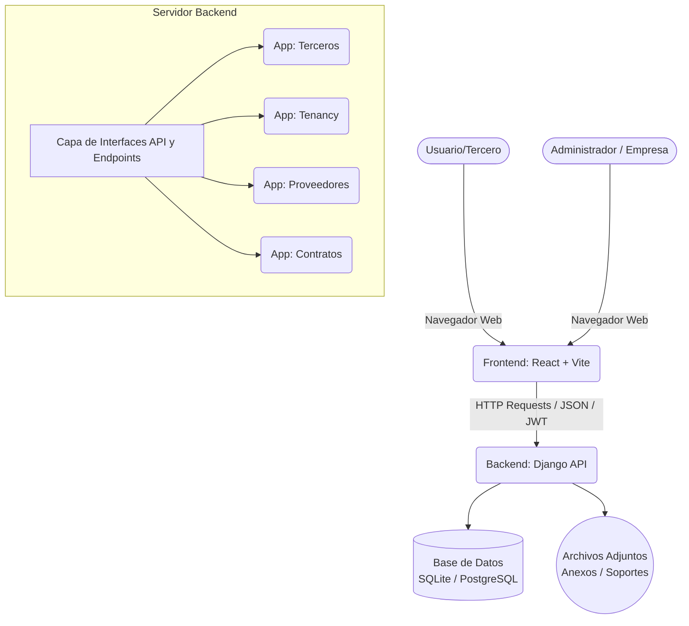
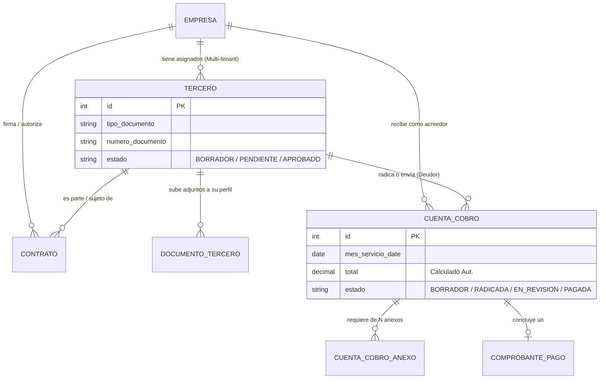
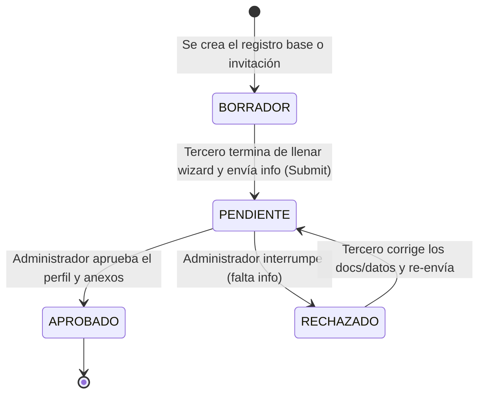
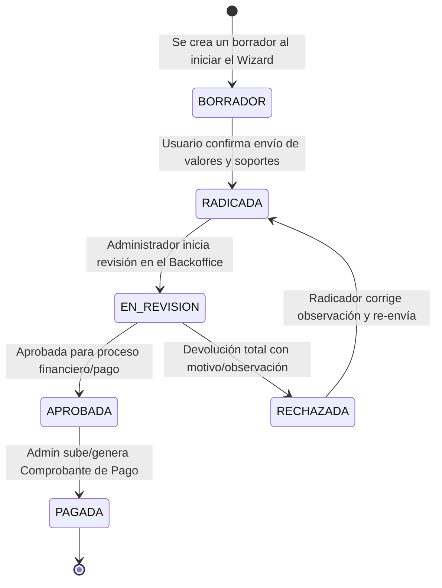

# Guía Completa del Proyecto GRAPP

Bienvenido a la documentación central de **GRAPP**, un sistema integral para la gestión de terceros, radicación de cuentas de cobro y contratos.

## 1. Visión General del Proyecto

GRAPP está compuesto por dos partes principales:
- **Backend (API Base)**: Desarrollado en **Django** (Python), encargado de proporcionar una API RESTful, manejar la base de datos y la lógica de negocio subyacente.
- **Frontend (Interfaz de Cliente)**: Desarrollado en **React** y construído empaquetado por **Vite** (TypeScript), que consume la API del backend para ofrecer una interfaz web moderna, responsiva y rápida a los usuarios.

El sistema maneja dos flujos de trabajo principales:
1. **Vinculación (Onboarding)**: Flujo de tipo "asistente" o wizard, basado en tokens por correo electrónico (sin requerir creación previa de cuenta o contraseña) para invitar y registrar a proveedores u otros terceros.
2. **Radicación**: Flujo mediante asistente para que los terceros puedan radicar (ingresar) sus cuentas de cobro/facturas y adjuntar sus documentos contables requeridos. Este flujo puede ser completado con token o con autenticación completa.

---

## 2. Arquitectura General del Sistema



### 2.1 Componentes Principales del Backend (Apps)

El backend divide las responsabilidades en distintas aplicaciones de Django:

- **Tenancy**: Maneja el soporte Multi-Inquilino (Multi-tenant). Contiene modelos fundamentales como `Empresa` y `ContactoEmpresa`. Cada inquilino/cliente aislará su información a través de la relación de clave foránea `empresa_fk`.
- **Terceros**: Gestión centralizada y perfiles de los proveedores o terceros vinculados al sistema. Incluye sub-módulos y modelos de:
  - Perfiles: Estudio, Curso, Certificación, Experiencia Laboral, etc.
  - Documentos Personales: `DocumentoTercero`, `DocumentoRequerido`
  - Invitaciones e Ingreso: `InvitacionVinculacion`, `TokenActivacionTercero`
- **Proveedores**: Responsable de la la radicación de cuentas de cobro y flujos administrativos o pagos.
  - Modelos principales: `CuentaCobro`, `CuentaCobroAnexo`, `TipoAnexo`, `ComprobantePago`, `InvitacionRadicacion`.
- **Contratos**: Maneja la relación contractual legal o comercial entre cada `Empresa` y el contratista (`Contrato`).

### 2.2 Estructura del Frontend

El frontend está estructurado para consumir la API de Django mediante **Axios**, implementando interceptores especiales para adjuntar e inyectar automáticamente el JWT de Autenticación a cada llamado API.

- **`src/lib/api.ts`**: Cliente base o conector principal para Axios. Incluye objetos exportados como `vinculacionAPI` y `terceroAPI` para un acceso estructurado a los endpoints.
- **`src/api/wizardApi.ts`**: Cliente estrictamente tipado (TypeScript) para el flujo central de radicación y su Wizard/Asistente.
- **`src/context/AuthContext.tsx`**: Provee el estado global de autenticación en la aplicación al árbol de React, manejando la sesión, logout automático en caso de expiración (Error 401) y administración del token en el `localStorage`.
- **`src/hooks/useCuentaWizard.ts`**: Hook personalizado para manejar y conservar el estado de validación y progresos a través de los distintos pasos del Asistente de Radicación.

---

## 3. Modelo de Datos Entidad-Relación (Simplificado)

Este diagrama ilustra las relaciones de núcleo que sustentan las operaciones principales en GRAPP.



---

## 4. Flujos Claves de Trabajo (Workflows)

### 4.1 Ciclo de Vida del Tercero (Onboarding y Vinculación)



### 4.2 Ciclo de Vida de la Cuenta de Cobro (Radicación)



---

## 5. Diseño, Seguridad y Autenticación

1. **Seguridad Multi-Tenancy**: Los tokens y la API manejan validaciones basadas en `empresa_fk` para asegurar en estricto que cada cliente y administrador de inquilino solo acceda y modifique registros de su ámbito correspondiente.
2. **Tokens de Acceso JWT (SimpleJWT)**: Todo el consumo API con inicio de sesión está protegido con JSON Web Tokens.
   - Tokens de Acceso (`Access Token`): Duración aproximada de 60 minutos.
   - Tokens de Refresco (`Refresh`): Duración de 1 día, con rotación continua. Almacenado localmente en la llave `grapp_access_token`.
3. **Flujos Sin Autenticación Explícita ("Magic Links")**: Para optimizar brutalmente la conversión Onboarding, el proceso de *Vinculación* envía URLs firmadas (con hash y UUIDs en baseDatos) ocultando la fricción al usuario final que sube documentos sin necesitar de recordar una contraseña al inicio.
4. **Cálculos Financieros Robustos**: El modelo fundamental `CuentaCobro.recalcular_total()` abstrae responsabilidades sensibles (Impuestos básicos, contingencias, IBC, o descuentos por tipo administración o gastos de representación) en un solo punto asegurando que las sumatorias en el FrontEnd nunca discrepen o puedan ser alteradas ilegítimamente.

---

## 6. Comandos Recurrentes de Desarrollo y Mantenimiento

### Entorno Backend Django (Raíz: `C:\GRAPP`)

```bash
# Iniciar servidor local
python manage.py runserver

# Aplicar cualquier migración pendiente a Base de Datos
python manage.py migrate

# Crear nuevas migraciones en las apps tras editar Models de Django
python manage.py makemigrations

# Ejecutar el conjunto completo de Pure Unit Tests en entorno aislado
python manage.py test

# Correr los tests sobre una app específica
python manage.py test terceros
```

### Entorno Frontend React+Vite (Directorio: `C:\GRAPP\frontend`)

```bash
# Iniciar servidor local de Desarrollo
npm run dev

# Auditar o analizar el código en busca de discrepancias o malas prácticas TypeScript/React
npm run lint

# Empaquetar el aplicativo minificando código de origen para Producción
npm run build
```

_Guía construida considerando un acercamiento general a GRAPP y fundamentada directamente sobre el código nativo disponible._
