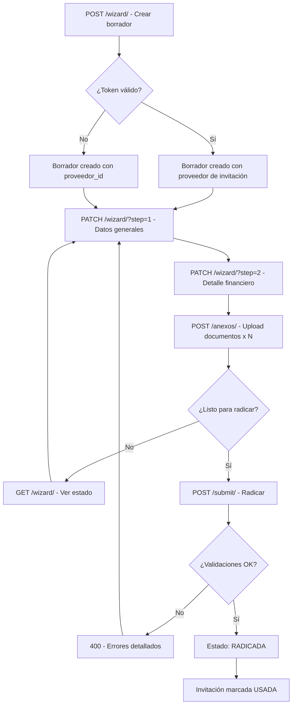

# API Wizard: Radicación de Cuenta de Cobro

## Resumen

Sistema backend-driven de wizard para radicación de cuentas de cobro en GRAPP, implementado con Django REST Framework.

**Estado del proyecto**: ✅ Completamente implementado y funcional

---

## Arquitectura

### Modelos Principales

#### `CuentaCobro`
- **Estados**: `BORRADOR` → `RADICADA` → `EN_REVISION` → `APROBADA`/`RECHAZADA` → `PAGADA`
- **Campos clave**:
  - `empresa` (FK), `proveedor` (FK), `contrato` (FK, opcional)
  - Datos generales: `numero`, `periodo`, `concepto`, `observaciones`
  - Detalle financiero: `valor_base`, `iva_valor`, `admon`, `imprevistos`, `utilidad`, `valor_total`
- **Método**: `recalcular_total()` - calcula suma de componentes

#### `TipoAnexo`
- Catálogo de tipos de documentos anexos
- `codigo` (unique), `nombre`, `obligatorio` (bool)
- 3 tipos obligatorios por defecto: Cuenta de Cobro, Informe de Actividades, Planilla de Seguridad Social

#### `CuentaCobroAnexo`
- Relación M2M entre CuentaCobro y archivos adjuntos
- `cuenta_cobro` (FK), `tipo_anexo` (FK), `descripcion`, `archivo` (FileField)

#### `InvitacionRadicacion`
- Sistema de invitaciones por token para proveedores
- `token` (unique, auto-generado), `estado` (`PENDIENTE`/`USADA`/`EXPIRADA`)
- Marca como `USADA` al hacer submit final

---

## Endpoints del Wizard

Base URL: `/api/cuentas-cobro/`

### 1. Crear Borrador

**Endpoint**: `POST /api/cuentas-cobro/wizard/`

**Propósito**: Inicia un nuevo flujo de radicación creando una cuenta en estado `BORRADOR`.

**Request Body**:
```json
{
  "token": "abc123xyz...",  // Opcional: token de InvitacionRadicacion
  "proveedor_id": 42        // Opcional: ID del tercero (si no hay token)
}
```

> **Nota**: Debe proporcionar `token` O `proveedor_id`. Si usa token, valida que la invitación esté `PENDIENTE`.

**Response** (201 Created):
```json
{
  "id": 1,
  "empresa": 1,
  "proveedor": 42,
  "proveedor_nombre": "Juan Pérez",
  "contrato": null,
  "contrato_numero": null,
  "numero": "",
  "periodo": "",
  "concepto": "",
  "observaciones": "",
  "valor_base": "0.00",
  "iva_valor": "0.00",
  "admon": "0.00",
  "imprevistos": "0.00",
  "utilidad": "0.00",
  "valor_total": "0.00",
  "estado": "BORRADOR",
  "created_at": "2026-01-23T18:25:00Z",
  "updated_at": "2026-01-23T18:25:00Z",
  "anexos": [],
  "step1_ok": false,
  "step2_ok": false,
  "anexos_ok": false
}
```

**Validaciones**:
- Token debe existir y estar en estado `PENDIENTE`
- Proveedor debe estar `APROBADO` y ser tipo `PROVEEDOR` o `CONTRATISTA`

---

### 2. Obtener Estado del Wizard

**Endpoint**: `GET /api/cuentas-cobro/{id}/wizard/`

**Propósito**: Consulta el estado actual de la cuenta con flags de completitud por paso.

**Response** (200 OK):
```json
{
  "id": 1,
  "estado": "BORRADOR",
  "step1_ok": true,    // ✓ contrato, numero, periodo, concepto completos
  "step2_ok": true,    // ✓ valor_total == recalcular_total()
  "anexos_ok": true,   // ✓ al menos 1 anexo existe
  "numero": "CC-2026-001",
  "periodo": "Enero 2026",
  "concepto": "Servicios de consultoría",
  "contrato": 5,
  "contrato_numero": "CONT-2025-123",
  "valor_base": "5000000.00",
  "iva_valor": "950000.00",
  "admon": "150000.00",
  "imprevistos": "100000.00",
  "utilidad": "300000.00",
  "valor_total": "6500000.00",
  "anexos": [
    {
      "id": 1,
      "tipo_anexo": 1,
      "tipo_anexo_nombre": "Cuenta de Cobro",
      "descripcion": "Cuenta de cobro firmada",
      "archivo_url": "/media/cuentas_cobro/anexos/cuenta_2026_01.pdf",
      "created_at": "2026-01-23T18:30:00Z"
    }
  ]
}
```

**Flags de Completitud**:
- `step1_ok`: `true` si `contrato`, `numero`, `periodo`, `concepto` están llenos
- `step2_ok`: `true` si `valor_total` == `recalcular_total()`
- `anexos_ok`: `true` si existe al menos 1 anexo

---

### 3. Actualizar Step 1 (Datos Generales)

**Endpoint**: `PATCH /api/cuentas-cobro/{id}/wizard/?step=1`

**Propósito**: Guarda los datos generales del paso 1.

**Request Body**:
```json
{
  "contrato": 5,
  "numero": "CC-2026-001",
  "periodo": "Enero 2026",
  "concepto": "Servicios de consultoría técnica en arquitectura de software",
  "observaciones": "Incluye revisión de código y documentación técnica"
}
```

**Response**: Retorna estado completo del wizard (igual que GET).

**Validaciones**:
- Solo permite edición si `estado == "BORRADOR"`
- `contrato`, `numero`, `periodo`, `concepto` son requeridos para `step1_ok`

**Errores**:
```json
{
  "detail": "Solo se pueden editar cuentas de cobro en estado BORRADOR."
}
```

---

### 4. Actualizar Step 2 (Detalle Financiero)

**Endpoint**: `PATCH /api/cuentas-cobro/{id}/wizard/?step=2`

**Propósito**: Guarda el detalle financiero. **Auto-calcula** `valor_total`.

**Request Body**:
```json
{
  "valor_base": "5000000.00",
  "iva_valor": "950000.00",
  "admon": "150000.00",
  "imprevistos": "100000.00",
  "utilidad": "300000.00"
}
```

> **Importante**: NO envíe `valor_total` en el request. El backend lo calcula automáticamente usando `recalcular_total()`.

**Response**: Retorna estado completo con `valor_total` calculado.

**Validaciones**:
- Solo permite edición si `estado == "BORRADOR"`
- Todos los valores deben ser >= 0
- `valor_total` se recalcula siempre al guardar

**Cálculo**:
```python
valor_total = valor_base + iva_valor + admon + imprevistos + utilidad
```

---

### 5. Listar Anexos

**Endpoint**: `GET /api/cuentas-cobro/{id}/anexos/`

**Response** (200 OK):
```json
[
  {
    "id": 1,
    "tipo_anexo": 1,
    "tipo_anexo_nombre": "Cuenta de Cobro",
    "descripcion": "Documento principal firmado",
    "archivo_url": "/media/cuentas_cobro/anexos/cc_2026_01.pdf",
    "created_at": "2026-01-23T18:30:00Z"
  },
  {
    "id": 2,
    "tipo_anexo": 3,
    "tipo_anexo_nombre": "Informe de Actividades",
    "descripcion": "Reporte mensual de horas",
    "archivo_url": "/media/cuentas_cobro/anexos/informe_ene.pdf",
    "created_at": "2026-01-23T18:35:00Z"
  }
]
```

---

### 6. Subir Anexo

**Endpoint**: `POST /api/cuentas-cobro/{id}/anexos/`

**Content-Type**: `multipart/form-data`

**Request Form Data**:
```
tipo_anexo: 1                          // ID del TipoAnexo
tipo_anexo_codigo: "CUENTA_COBRO"      // Alternativa: código en lugar de ID
descripcion: "Firma digital incluida"
archivo: [binary file]
```

> **Nota**: Puede usar `tipo_anexo` (ID) O `tipo_anexo_codigo` (string).

**Response** (201 Created):
```json
{
  "id": 3,
  "tipo_anexo": 1,
  "tipo_anexo_nombre": "Cuenta de Cobro",
  "descripcion": "Firma digital incluida",
  "archivo_url": "/media/cuentas_cobro/anexos/cc_firmada.pdf",
  "created_at": "2026-01-23T18:40:00Z"
}
```

**Validaciones**:
- Solo permite upload si `estado == "BORRADOR"`
- `tipo_anexo` debe existir en el catálogo
- Archivo es requerido

**Errores**:
```json
{
  "error": "Solo se pueden agregar anexos a cuentas en estado BORRADOR."
}
```

---

### 7. Eliminar Anexo

**Endpoint**: `DELETE /api/cuentas-cobro/{id}/anexos/{anexo_id}/`

**Response**: `204 No Content` (sin body)

**Validaciones**:
- Solo permite delete si `estado == "BORRADOR"`
- El anexo debe pertenecer a la cuenta especificada

**Errores**:
```json
{
  "error": "Solo se pueden eliminar anexos de cuentas en estado BORRADOR."
}
```

---

### 8. Submit Final (Radicar)

**Endpoint**: `POST /api/cuentas-cobro/{id}/submit/`

**Propósito**: Radica la cuenta de cobro (transición `BORRADOR` → `RADICADA`). Aplica validaciones duras y marca invitación como `USADA`.

**Request Body**: `{}` (vacío)

**Response** (200 OK):
```json
{
  "id": 1,
  "estado": "RADICADA",
  "message": "Cuenta de cobro radicada exitosamente."
}
```

**Validaciones Duras** (todas deben pasar):

1. **Step 1**: `contrato`, `numero`, `periodo`, `concepto` deben estar llenos
2. **Step 2**: `valor_total` debe ser == `recalcular_total()`
3. **Anexos**:
   - Debe existir al menos 1 anexo
   - Todos los `TipoAnexo` con `obligatorio=True` deben tener un anexo asociado

**Errores** (400 Bad Request):
```json
{
  "step1": "Datos generales incompletos (contrato, numero, periodo, concepto requeridos).",
  "step2": "El valor_total (6500000.00) no coincide con el cálculo (6600000.00).",
  "anexos": "Debe agregar al menos un anexo antes de radicar.",
  "anexos_obligatorios": [
    "Falta anexo obligatorio: Informe de Actividades",
    "Falta anexo obligatorio: Planilla de Seguridad Social"
  ]
}
```

**Efectos del Submit**:
- ✅ `CuentaCobro.estado` → `"RADICADA"`
- ✅ `InvitacionRadicacion.estado` → `"USADA"` (si se usó token)
- ✅ `InvitacionRadicacion.used_at` → timestamp actual
- ✅ Operación atómica (`transaction.atomic`)

**Restricciones**:
- Solo se puede radicar si `estado == "BORRADOR"`
- Después de radicar, NO se puede editar (guards en steps 1, 2, anexos)

---

## Endpoint Auxiliar: Catálogo de Tipos de Anexo

**Endpoint**: `GET /api/tipos-anexo/`

**Response** (200 OK):
```json
[
  {
    "id": 1,
    "codigo": "CUENTA_COBRO",
    "nombre": "Cuenta de Cobro",
    "obligatorio": true
  },
  {
    "id": 2,
    "codigo": "FACTURA",
    "nombre": "Factura",
    "obligatorio": false
  },
  {
    "id": 3,
    "codigo": "INFORME_ACTIVIDADES",
    "nombre": "Informe de Actividades",
    "obligatorio": true
  },
  {
    "id": 6,
    "codigo": "SEGURIDAD_SOCIAL",
    "nombre": "Planilla de Seguridad Social",
    "obligatorio": true
  }
]
```

**Inicialización**: Ejecutar `python manage.py init_tipos_anexo`

---

## Flujo Completo del Wizard

### Paso a Paso



### Ejemplo de Flujo en JavaScript

```javascript
// 1. Crear borrador
const createRes = await fetch('/api/cuentas-cobro/wizard/', {
  method: 'POST',
  headers: { 'Content-Type': 'application/json' },
  body: JSON.stringify({ token: 'abc123xyz' })
});
const { id } = await createRes.json();

// 2. Completar Step 1
await fetch(`/api/cuentas-cobro/${id}/wizard/?step=1`, {
  method: 'PATCH',
  headers: { 'Content-Type': 'application/json' },
  body: JSON.stringify({
    contrato: 5,
    numero: 'CC-2026-001',
    periodo: 'Enero 2026',
    concepto: 'Servicios de consultoría'
  })
});

// 3. Completar Step 2
await fetch(`/api/cuentas-cobro/${id}/wizard/?step=2`, {
  method: 'PATCH',
  headers: { 'Content-Type': 'application/json' },
  body: JSON.stringify({
    valor_base: '5000000.00',
    iva_valor: '950000.00',
    admon: '150000.00',
    imprevistos: '100000.00',
    utilidad: '300000.00'
  })
});

// 4. Subir anexos (multipart)
for (const file of files) {
  const formData = new FormData();
  formData.append('tipo_anexo_codigo', file.tipo);
  formData.append('descripcion', file.desc);
  formData.append('archivo', file.blob);
  
  await fetch(`/api/cuentas-cobro/${id}/anexos/`, {
    method: 'POST',
    body: formData
  });
}

// 5. Verificar estado
const statusRes = await fetch(`/api/cuentas-cobro/${id}/wizard/`);
const { step1_ok, step2_ok, anexos_ok } = await statusRes.json();

// 6. Radicar si todo está OK
if (step1_ok && step2_ok && anexos_ok) {
  const submitRes = await fetch(`/api/cuentas-cobro/${id}/submit/`, {
    method: 'POST',
    headers: { 'Content-Type': 'application/json' },
    body: '{}'
  });
  const result = await submitRes.json();
  console.log(result.message); // "Cuenta de cobro radicada exitosamente."
}
```

---

## Guardias de Estado

| Operación | Estado Permitido | Error si no cumple |
|-----------|------------------|-------------------|
| PATCH Step 1 | `BORRADOR` | "Solo se pueden editar cuentas... BORRADOR" |
| PATCH Step 2 | `BORRADOR` | "Solo se pueden editar cuentas... BORRADOR" |
| POST Anexo | `BORRADOR` | "Solo se pueden agregar anexos a... BORRADOR" |
| DELETE Anexo | `BORRADOR` | "Solo se pueden eliminar anexos de... BORRADOR" |
| POST Submit | `BORRADOR` | "Solo se pueden radicar cuentas en... BORRADOR" |

> **Diseño**: Una vez radicada (`RADICADA`), la cuenta NO puede modificarse desde el wizard.

---

## Archivos del Proyecto

### Componentes Backend Nuevos

```
proveedores/
├── models.py                # CuentaCobro, TipoAnexo, CuentaCobroAnexo
├── wizard_serializers.py   # 6 serializers del wizard
├── wizard_viewsets.py       # CuentaCobroWizardViewSet + TipoAnexoViewSet
├── management/commands/
│   └── init_tipos_anexo.py  # Seed data command
└── migrations/
    └── 0003_tipoanexo_remove_cuentacobro_soporte_and_more.py

contratos/
├── models.py                # Contrato (nuevo app)
├── admin.py
└── migrations/
    └── 0001_initial.py

GRAPP/
└── urls.py                  # Router config + wizard endpoints
```

### Componentes Frontend (a implementar)

```typescript
// Sugerencia de estructura React
src/pages/
  CuentaCobroWizardPage.tsx      // Contenedor principal
src/components/wizard/
  Step1DatosGenerales.tsx        // Formulario step 1
  Step2DetalleFinanciero.tsx     // Formulario step 2 (auto-cálculo)
  Step3AnexosUpload.tsx          // Drag & drop + lista
  WizardProgressBar.tsx          // Indicador visual de progreso
src/hooks/
  useCuentaCobroWizard.ts        // Custom hook para lógica
```

---

## Comandos de Gestión

### Inicializar Tipos de Anexo
```bash
python manage.py init_tipos_anexo
```

**Output**:
```
[+] Creado: FACTURA - Factura
[+] Creado: INFORME_ACTIVIDADES - Informe de Actividades
[~] Actualizado: CUENTA_COBRO - Cuenta de Cobro
...
[OK] Proceso completado: 6 creados, 1 actualizados
```

### Crear Invitación de Radicación (Admin Django)
```python
from proveedores.models import InvitacionRadicacion
from terceros.models import Tercero
from tenancy.models import Empresa

inv = InvitacionRadicacion.objects.create(
    empresa=Empresa.objects.first(),
    proveedor=Tercero.objects.get(id=42),
    email="proveedor@example.com"
)
print(f"Token: {inv.token}")
```

---

## Notas de Implementación

### Seguridad y Tenant Filtering

⚠️ **TODO**: Implementar filtrado por tenant/empresa en producción.

Actualmente, `get_empresa()` retorna la primera empresa o crea una de prueba. En producción, debe:
- Extraer empresa del subdominio, JWT, o header
- Filtrar `CuentaCobro` por `empresa` del request
- Validar que el usuario tenga permisos sobre esa empresa

### Autenticación por Token (Invitaciones)

El flujo actual valida `InvitacionRadicacion.token` en el payload. Para un flujo más seguro:
- Opción 1: Enviar token como query param (`?token=abc...`)
- Opción 2: Autenticación JWT temporal generada desde el token
- Opción 3: Link mágico one-time-use

### Cálculo Automático de Totales

`valor_total` SIEMPRE se recalcula en el backend (`WizardStep2Serializer.update()`). El frontend:
- NO debe incluir `valor_total` en el PATCH
- DEBE mostrarlo como read-only después de guardar
- Puede pre-calcularlo en el cliente para preview, pero el backend es la fuente de verdad

### Anexos Obligatorios Dinámicos

Los anexos obligatorios se leen de `TipoAnexo.objects.filter(obligatorio=True)`. Para cambiar cuáles son obligatorios:
- Opción 1: Actualizar via admin Django
- Opción 2: Modificar `init_tipos_anexo.py` y re-ejecutar

---

## Próximos Pasos

### Testing Pendiente
- [ ] Test de create con token válido/inválido
- [ ] Test de step updates con estado incorrecto (debe fallar si != BORRADOR)
- [ ] Test de submit sin anexos obligatorios (debe retornar error específico)
- [ ] Test de transición de estado (BORRADOR → RADICADA)
- [ ] Test de invitación marcada como USADA

### Mejoras Sugeridas
- [ ] Endpoint para listar contratos activos del proveedor
- [ ] Webhook/notificación al radicar (email a empresa)
- [ ] Validación de duplicados (misma empresa + proveedor + numero)
- [ ] Soft delete en anexos (archivado en lugar de eliminar)
- [ ] Versionado de cuentas de cobro (histórico de cambios)

---

**Documentación generada**: 2026-01-23  
**Versión API**: 1.0  
**Framework**: Django 6.0 + DRF 3.x
